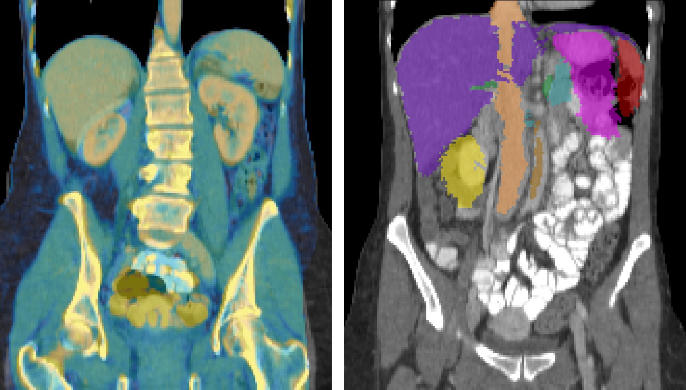

# deedsBCV
Code for efficient 3D discrete deformable registration for medical images

by Mattias P. Heinrich

This implementation has been comprehensively evaluated on 100 abdominal CT scans, for inter-patient registration and compared to several state-of-the-art approaches, including ANTS-SyN, IRTK and NiftyReg. It reaches the highest accuracy for all 13 anatomical structures, in particular kidney, stomach and difficult structures such as pancreas or inferior vena cava. Details on these experiments can be found in Zhoubing Xu's comparison paper: http://discovery.ucl.ac.uk/1501854/1/Modat_TBME-01460-2015.R2-preprint.pdf.

Note, that the following results are for using a single atlas only and they can be substantially improved with multi-atlas label fusion (e.g. joint label fusion). See for the MICCAI 2015 challenge on Multi-Atlas Label Fusion Beyond the Cranial Vault (BCV): https://www.synapse.org/#!Synapse:syn3193805/wiki/217785 

The following table lists a subset of the results in terms of Dice overlap (or mean surface distance) with manual segmentations. 

| Registration Method  | ANTS-MI | IRTK | NiftyReg | **deeds** | deeds+JLF |
| ------------- | --------- | --------- | --------- |  --------- |  --------- | 
| Spleen (1) | 38.0% | 49.1% | 62.2% | **69.1%** | 91.9% |
| Left Kidney (3) | 31.4% | 41.7% | 55.0% | **75.6 %** | 91.7% |
| Liver (6) | 63.5% | 71.1% | 78.8% | **84.1%** | 94.8% | 
| Stomach (7) | 26.9% | 26.9% | 33.8% | **52.0%** | 80.5% |
| Vena Cava (9) | 24.7% | 27.8% | 44.3% | **60.5%** | 82.8% |
| Pancreas (11) | 12.9% | 14.2% | 17.8% | **39.8%** | 74.0% |
| MSD avg (all 13) | 20.68 | 20.36 | 16.98 | **9.79** | 2.26 |

The average run-time on a dual-core laptop is around 60 seconds for the nonlinear registration of images with 8 million voxels. 

## Installation

### Simply use provided Makefile to compile deedsBCV, linearBCV applyBCV and applyBCVfloat
```bash
make
```
The code requires a Unix-based system (Linux, OS X or Ubuntu-Bash in Win10), a g++ compiler and an installed zlib library. Optional but recommend are OpenMP support and SSE4.2 and AVX2 flags. In case your CPU does have SIMD extensions try 
```bash
make SLOW=1
```

It is recommend to alos install the excellent c3d convert tool of ITK-Snap to preprocess images http://www.itksnap.org/pmwiki/pmwiki.php?n=Downloads.C3D 

## Citation

If you use this implementation or parts of it please cite:
 
 "MRF-Based Deformable Registration and Ventilation Estimation of Lung CT."
 by Mattias P. Heinrich, M. Jenkinson, M. Brady and J.A. Schnabel
 IEEE Transactions on Medical Imaging 2013, Volume 32, Issue 7, July 2013, Pages 1239-1248
 http://dx.doi.org/10.1109/TMI.2013.2246577
 
 and
 
 "Multi-modal Multi-Atlas Segmentation using Discrete Optimisation and Self-Similarities"
 by Mattias P. Heinrich, Oskar Maier and Heinz Handels
 VISCERAL Challenge@ ISBI, Pages 27-30 2015
 http://ceur-ws.org/Vol-1390/visceralISBI15-4.pdf
 
## Usage

### Executables
There are four binaries: deedsBCV (nonlinear registration), linearBCV (affine pre-alignment), applyBCV (transform another short integer segmentation) and applyBCVfloat (transform another grayvalue scan).

**All input images are required to be nii.gz format and have same dimensions** (please also see example). Since, the method does not take anisotropic voxel spacing into account, it is recommend to resample the scans (in case they have very thick slices).

### Parameters
The registration method uses a contrast and modality-invariant similarity metric, based on binarised SSC descriptors as described in my MICCAI 2013 paper: "Towards Realtime Multimodal Fusion for Image-Guided Interventions Using Self-similarities".

Importantly, the approach relies on a **dense displacement search** as detailed in my TMI paper: 'MRF-based deformable registration and ventilation estimation of lung CT' and performs several (usually five) iterations (on a single high-resolution) with different grid-spacings. These **control-point spacings are by default defined** as

 -G grid spacing for each level (default 8x7x6x5x4)
 
There are two more parameters, which specify the discrete search namely the radius (of steps):

 -L maximum search radius (default 8x7x6x5x4)
 
 and the (integer) quantisation of the search steps
 
  -Q quantisation step (default 5x4x3x2x1)
  
 The **product of these two numbers gives the maximum displacement for each level (in voxels)**. So if you e.g. expect deformations of about 40 voxels you could choose -L 8 and -Q 5 (for the first level). To keep memory and computational demand to reasonable levels, it is recommended to have similar numbers for -G and -L for each level.
 
The affine/linear registration selects the optimal displacement for each control point and finds a robust transform using least trimmed squares. Afterwards, the images are warped and the procedure is repeat for all other levels.

In the deformable registration, the neighbourhood relations of the control point grid are approximated using a minimum-spanning-tree to efficiently find a smooth displacement field given an additional registration parameter (which is set by default to 1.6) using the flag -a. It can be increased to obtain smoother transforms and decreased to make the registration more aggressive (but it's influence is generally moderate).


## Prerequisites to run example

### 1) Create free synapse.org account and download dataset
"Beyond the Cranial Vault" MICCAI workshop (https://www.synapse.org/#!Synapse:syn3193805/wiki/89480)

Log in, click on 'Files' and select 'Abdomen' (or go to https://www.synapse.org/#!Synapse:syn3376386)
you will only need to download RawData.zip (which has a size of 1.53 GBytes and contains 30 scans) and subsequently extract the files. 
In case you do not want to creat a synapse.org account please see alternative example below.

### 2) Resample example scans with c3d
```bash
c3d img/img0002.nii.gz -resample-mm 2x2x2mm -region 0x0x10vox 180x140x190vox -origin-voxel 0x0x0vox -flip y -o img2_res.nii.gz
c3d img/img0004.nii.gz -resample-mm 2x2x2mm -region 0x0x20vox 180x140x190vox -origin-voxel 0x0x0vox -pad 14x0x0vox 14x0x0vox -1024 -flip y -o img4_res.nii.gz
c3d label/label0002.nii.gz -int 0 -resample-mm 2x2x2mm -region 0x0x10vox 180x140x190vox -origin-voxel 0x0x0vox -flip y -o seg2_res.nii.gz
c3d label/label0004.nii.gz -int 0 -resample-mm 2x2x2mm -region 0x0x20vox 180x140x190vox -origin-voxel 0x0x0vox -pad 14x0x0vox 14x0x0vox  0 -flip y -o seg4_res.nii.gz
```

Please, consider to check the output visually. Alternatively, you can find the programm preprocessAbdomen.cpp in src, which performs exactly the same resampling cropping that I have used for the registration challenge. To potentially improve the accuracy at the cost of longer run-times a smaller voxel spacing would be advisable, when increasing the grid-spacing or step quantisation accordingly.

### 3) Run affine/linear registration
Call the linear registration with the following arguments:
```bash
./linearBCV -F img2_res.nii.gz -M img4_res.nii.gz -O affine_2_4
```
These three arguments are mandatory: -F specifies the fixed image, -M the moving one, and -O defines the base of the output filenames. A detailed description of all optional parameters is obtained by calling ./linearBCV -h

The registration should only take a few seconds and provide the following output:
```bash
+0.887 | -0.025 | +0.035 | -0.000 
+0.051 | +0.773 | -0.039 | -0.000 
+0.014 | +0.002 | +1.036 | -0.000 
+6.895 | +40.934 | -4.635 | +1.000 
```
The affine matrix is also stored in affine_2_4_matrix.txt. It does not consider voxel-spacings and the translational part is in the last row (and not column). The text file will be passed to deeds in the next step.

### 4) Run deformable deeds 
We will use the affine matrix "affine_2_4_matrix.txt" to initialise the deformable registration. The output filenames are generated using the base "nonlinear_2_4". 

Note that the input images are the same as before, but we can optionally pass the segmentation of the moving image with -S. We will therefore obtain two transformed scans nonlinear_2_4_deformed.nii.gz (the CT scan) and nonlinear_2_4_deformed_seg.nii.gz (the warped segmentation). The displacements are stored (for all control points) in _displacements.dat:
```bash
./deedsBCV -F img2_res.nii.gz -M img4_res.nii.gz -O nonlinear_2_4 -A affine_2_4_matrix.txt -S seg4_res.nii.gz
```
To change the default parameters for grid spacing (discussed above) to speed up the computation, we can e.g. use "-L 6x5x4x3x2", which reduces the time by half.

### 5) Apply transform and evaluate results
We can use the option -overlap of c3d to quantify the segmentation accuracy. There is also a small tool diceMulti to calculate the Dice for all labels. For the default settings, this should yield the following values:
Dice:  69.4% (spleen), 62.5% (right kidney),  82.3% (left kidney),  30.8% (gallbladder),  57.6% (esophagus),  83.8% (liver),  26.0% (stomach),  78.1% (aorta),  79.8% (vena cava),  42.2% (portal vein),  24.9% (pancreas),  47.2% (r adrenal gland),  28.7% (l adrenal gland)

AVERAGE DICE: 54.9%

The visual overlay of this example seems quite convincing:



When the transformation is later required to warp another segmentation or scan, you can use the applyBCV executable:
```bash
./applyBCV -M seg4_res.nii.gz -O nonlinear_2_4 -D second_warp.nii.gz -A affine_2_4_matrix.txt 
```
Don't forget to pass the affine matrix (unless you have omitted the linear registration). The difference between applyBCV and applyBCVfloat is that the first version employs nearest neighbour interpolation and writes the output as short datatype (useful for segmentations).

## Alternative example TCIA
Download (without registration) two examples (here #1 and #3) from the pancreas-CT dataset of the cancer imaging archive. https://wiki.cancerimagingarchive.net/display/Public/Pancreas-CT

Go to the DOI folder, create a folder output and convert the Dicom files into Nifti using the following converter: https://github.com/rordenlab/dcm2niix
```bash
i=PANCREAS_0001
d="$i/*/*/"
dcm2niix -m -f img1 -o output $d

i=PANCREAS_0003
d="$i/*/*/"
dcm2niix -m -f img3 -o output $d

```

Flip the ground truth labels
```bash
c3d ../TCIA_pancreas_labels-02-05-2017/label0001.nii.gz -flip y -o output/label1.nii.gz
c3d ../TCIA_pancreas_labels-02-05-2017/label0003.nii.gz -flip y -o output/label3.nii.gz
```

Resample and crop scans
```bash
c3d img1.nii -resample-mm 1.5x1.5x1.5mm -region 40x70x8vox 220x170x144 -origin-voxel 0x0x0vox -o img1_res.nii.gz
c3d img3.nii -resample-mm 1.5x1.5x1.5mm -region 4x30x0vox 220x170x144 -origin-voxel 0x0x0vox -o img3_res.nii.gz
c3d label1.nii.gz -int 0 -resample-mm 1.5x1.5x1.5mm -region 40x70x8vox 220x170x144 -origin-voxel 0x0x0vox -orient RAS -type short -o seg1_res.nii.gz
c3d label3.nii.gz -int 0 -resample-mm 1.5x1.5x1.5mm -region 4x30x0vox 220x170x144 -origin-voxel 0x0x0vox -orient RAS -type short -o seg3_res.nii.gz
```
It is best to now check visually (e.g. with ITK Snap), whether all scans and segmentations are processed correctly. You can also validate this by loading the two manual kidney segmentations provided by myself in /segment. Afterwards, simply run the linear and deformable registration as described above. You should obtain a Dice of 28.0% (linear) or 33.6% (deeds) for the pancreas and 35.1% (linear) or 79.2% (deeds) for the kidney.

TODO: example on how to apply joint label fusion

If you find any problems or need help, feel free to contact me at lastname @ uni-luebeck.de

Mattias Heinrich
